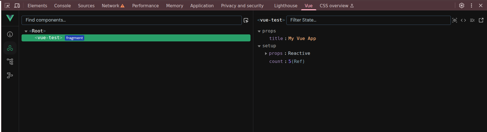
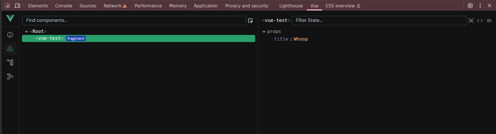

To test:
1. `npm install`
2. `npm run dev`

In Vue dev tools properties with `setup` can be observed:


Using `npm run build` and adding the exported bundle into an existing web server as:
```
<div id="test-container">
    <vue-test title="My Vue App" />
</div>
<script src="/static/js/bundle/vueTest.js"></script>
```
The Vue dev tools won't display `setup` related properties:

